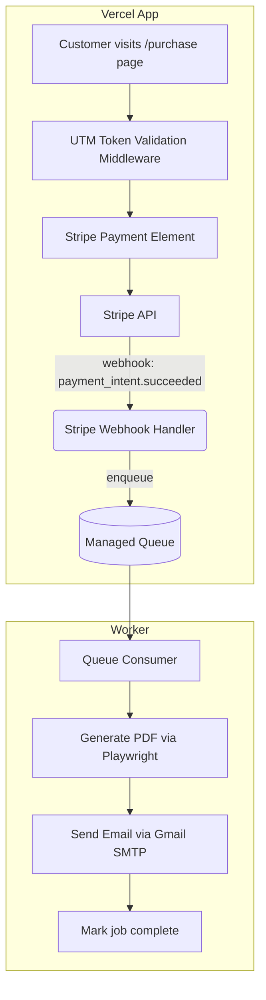

# SYSTEM.md (v1.2)

**Project**: Anthrasite.io
**Last Updated**: 2025-10-08
**Owner**: Anthrasite Platform Team
**Status**: Canonical Architecture Document (Ground Truth)

## 1. Purpose

This document defines the authoritative architecture of the **Anthrasite.io Payment Site** — the public-facing platform that accepts Stripe payments, validates purchase tokens, and delivers report artifacts.

It captures both **design intent** and **operational invariants**, ensuring the system remains reliable, secure, and maintainable as it evolves.

## 2. Core Technology Stack

| Layer                    | Technology                               | Notes                                                      |
| :----------------------- | :--------------------------------------- | :--------------------------------------------------------- |
| **Frontend**             | Next.js (App Router)                     | React 18, streaming server components enabled              |
| **Styling**              | Tailwind CSS                             | Consistent with Anthrasite brand kit                       |
| **Database**             | PostgreSQL (Vercel-hosted)               | Supabase-compatible schema                                 |
| **ORM**                  | Prisma                                   | Enforces type safety and schema consistency                |
| **Payments**             | Stripe Payment Element                   | Embedded flow using `PaymentIntent` API                    |
| **Queue / Job Dispatch** | Vercel KV or Upstash Queue               | Provides lightweight asynchronous job delivery             |
| **Worker Runtime**       | Node.js Worker or Supabase Edge Function | Consumes queued jobs and generates reports                 |
| **PDF Generation**       | Playwright (print-to-PDF)                | Deterministic, headless Chromium rendering                 |
| **Email Delivery**       | Google Workspace (Gmail SMTP)            | Provider-abstracted; swappable later for Postmark/SendGrid |
| **Testing**              | Vitest (unit) / Playwright (E2E)         | Modal pattern hardened for CI                              |
| **Deployment**           | Vercel                                   | Continuous deployment from main branch                     |

## 3. System Overview

The system follows a **decoupled webhook-to-worker pipeline** to ensure that payment processing, artifact generation, and delivery are reliable and idempotent.

## 4. Core Architectural Patterns

### 4.1. Decoupled Webhook / Worker Model

- **Intent**: Prevent Stripe webhook timeouts and ensure durability under transient outages.
- **Implementation**:
  - Webhook validates Stripe signature → enqueues job payload (`paymentIntentId`, `customerEmail`, `reportType`).
  - Worker consumes jobs asynchronously, ensuring at-least-once processing.
  - Idempotency key = `paymentIntentId`.
- **Guarantee**: No single payment can produce multiple emails or reports.

### 4.2. Idempotent UTM Token Authentication

- **Model**: `UtmToken(id, code, used, usedAt, createdAt)`
- **Contract**:
  - Middleware verifies that `code` exists and `used == false`.
  - Upon first valid purchase, token is atomically marked used (`UPDATE … WHERE used=false`).
- **Purpose**: Prevents replay or unauthorized purchases.

### 4.3. Producer–Validator Discipline

Borrowed from the LeadShop Temporal architecture:

| Stage       | Producer                       | Validator                 | Invariants                                                    |
| :---------- | :----------------------------- | :------------------------ | :------------------------------------------------------------ |
| **Webhook** | Stripe → `/api/stripe/webhook` | `verifyStripeSignature()` | Valid event type, payment succeeded, `paymentIntentId` unique |
| **Queue**   | Job Enqueuer                   | Queue Consumer            | Job payload schema valid (`zod` validated)                    |
| **Worker**  | PDF Generator                  | Artifact Validator        | PDF exists, size ≥ 20 KB, correct filename & MIME             |
| **Email**   | SMTP Sender                    | Delivery Logger           | Message accepted (2xx), attachment checksum verified          |

Each failure raises an explicit structured error and never silently retries without validation.

### 4.4. Centralized Database Write Model

- **Pattern**: “One-write-per-purchase.”
- **Rationale**: Mirrors LeadShop’s governed persistence queue to avoid connection storms.
- **Implementation**:
  - All inserts/updates occur through a single transactional write (`recordPurchase()` service).
  - Workers never write directly to user-facing tables outside that transaction.
  - Any background enrichment uses separate queues and tables (e.g., `purchase_artifacts`).

### 4.5. Environment Variable Precedence

- **Rule**: `.env` file values take precedence over host environment, enforced by `env_file: - .env` in `docker-compose.yml`.
- **Reason**: Prevents contamination from developer shell variables and ensures deterministic local builds.

### 4.6. E2E-Safe Modal UI

- Uses Flexbox positioning and toggles `opacity` + `visibility` (no CSS transforms).
- Ensures Playwright reliably detects visibility states; prevents flaky tests.

## 5. Operational Invariants

### 5.1. Universal Invariants

| #   | Invariant                                                                        | Enforced By        |
| :-- | :------------------------------------------------------------------------------- | :----------------- |
| 1   | **Provenance**: every job has `paymentIntentId`, `utmTokenId`, and `reportType`. | Queue schema       |
| 2   | **Idempotency**: repeated Stripe events do not duplicate jobs.                   | Webhook handler    |
| 3   | **Persistence atomicity**: DB writes are single-transaction.                     | `recordPurchase()` |
| 4   | **Artifact existence**: PDF must exist in storage before email send.             | Worker validator   |
| 5   | **Email integrity**: checksum of attachment logged alongside send record.        | Email service      |
| 6   | **Replay safety**: duplicate Stripe webhook events detected and ignored.         | Redis KV lock      |
| 7   | **Schema coherence**: Prisma migrations are versioned, no drift allowed.         | CI invariant       |
| 8   | **Time coherence**: all timestamps UTC ISO8601; conversions only in UI.          | Global util        |

### 5.2. Environment & Secret Handling

- Secrets (`STRIPE_SECRET_KEY`, `SMTP_PASSWORD`) are stored in **Vercel Encrypted Environment Variables**.
- Workers use scoped API keys with least privilege.
- Never commit `.env.local` to source control.

## 6. Failure Contracts and Recovery

| Failure Type             | Handling Strategy                                                                        |
| :----------------------- | :--------------------------------------------------------------------------------------- |
| Stripe webhook timeout   | Always return 200 OK after validation; enqueue async job regardless of downstream state. |
| Duplicate webhook events | Deduplicate by `paymentIntentId`.                                                        |
| Queue backlog            | Jobs are idempotent and safe to retry.                                                   |
| Worker crash mid-job     | Retry with exponential backoff (max 5 attempts).                                         |
| Email send failure       | Re-enqueue with reason `email_retry`.                                                    |
| Invalid PDF              | Raises structured `ArtifactValidationError` and alerts ops channel.                      |

## 7. Testing Strategy

- **Unit Tests (Vitest)**: Service layer contracts, Stripe webhook validator, UTM middleware.
- **Integration Tests**: Stripe test webhooks, end-to-end purchase simulation.
- **E2E Tests (Playwright)**: Full flow from `/purchase` → payment → email receipt, asserting modal visibility and PDF checksum.
- **CI Gate**: PRs blocked on failing tests or unformatted code.

## 8. Observability & Monitoring

- **Metrics**: Queue latency, job success/failure counts, average PDF generation time.
- **Logs**: Structured JSON logs streamed to Vercel Log Drains.
- **Alerts**: Failure thresholds trigger Slack webhook (#ops-anthrasite).
- **Correlation IDs**: Each job carries `traceId` propagated from Stripe event for end-to-end traceability.

## 9. Versioning & Evolution

- **Artifact Versioning**: PDF templates tagged as `report@v{n}` and included in metadata.
- **Schema Migrations**: Each production deployment must run `prisma migrate deploy`.
- **Document Updates**: `SYSTEM.md` must be revised with each major architectural change; version incremented accordingly.

## 10. Future Enhancements (Planned)

- **Postmark migration** – replace Gmail SMTP with API-based transactional mailer.
- **Supabase storage adoption** – replace ephemeral local storage for PDFs.
- **Stripe Customer Portal** – allow users to redownload past reports.
- **Temporal-based workflow migration** – unify with LeadShop orchestration model for observability and consistency.

## Appendix A — Core ADR References

| ADR | Title                            | Status   |
| :-- | :------------------------------- | :------- |
| 001 | Email Service Provider Selection | Accepted |
| 002 | E2E-Safe Modal Pattern           | Accepted |
| 003 | Decoupled Webhook Architecture   | Accepted |
| 004 | Queue Retry & Idempotency Policy | Draft    |
| 005 | Stripe Webhook Replay Mitigation | Draft    |

✅ **This file is the single source of truth for Anthrasite.io architecture.**
Any changes to runtime behavior, system boundaries, or invariants must be reflected here.
