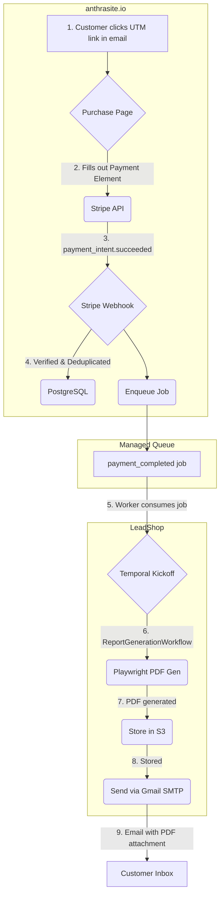

# Anthrasite.io System Architecture (v1.1)

This document provides a terse, ground-truth overview of the `anthrasite.io` payment and report delivery system. It is the single source of truth for this project's architecture.

**Note**: This system underwent a significant codebase cleanup (G1) in October 2025. Many legacy components and files were moved to a tracked `_archive` directory to establish a clean baseline.

## 1. Core Principles

- **Separation of Concerns**: The public-facing website (`anthrasite.io` on Vercel) is fully decoupled from the internal report generation engine (`LeadShop` on a local Mac mini). They communicate via a durable, managed queue.
- **Idempotency**: All critical operations, especially payment processing and workflow kickoff, are designed to be idempotent to prevent duplicate processing from events like webhook retries.
- **Progressive Enhancement**: The system is built with MVP components (Playwright for PDFs, Gmail for email) that can be swapped for more robust, scalable solutions (DocRaptor, Postmark) as business needs evolve.

## 2. System Topology

The system is split into two primary operational environments:

1.  **`anthrasite.io` (Vercel)**: Handles all public-facing interactions.
    -   **Responsibilities**: User authentication (via UTM token), presenting the sales page, processing payments with Stripe, and enqueuing jobs for the backend.
    -   **Components**:
        -   **Next.js Frontend**: Renders the purchase and success pages.
        -   **Stripe Payment Element**: Embedded on-page for collecting payment details.
        -   **Stripe Webhook Listener**: A Vercel serverless function that verifies, deduplicates, and logs incoming Stripe events.
        -   **PostgreSQL Database**: Stores `Business`, `Purchase`, and `UtmToken` data.
        -   **Managed Queue (e.g., SQS/Upstash)**: A durable message queue to bridge the gap to the internal `LeadShop` system.

2.  **`LeadShop` (Mac Mini)**: The internal, secure environment for business logic.
    -   **Responsibilities**: Consuming jobs from the queue, orchestrating report generation, and delivering the final PDF report.
    -   **Components**:
        -   **Queue Consumer Worker**: Polls the managed queue for new `payment_completed` jobs.
        -   **Temporal Worker**: Kicks off and manages the `ReportGenerationWorkflow`.
        -   **Playwright PDF Engine**: Generates the PDF report from a predefined HTML template.
        -   **S3 Storage**: Persists the final PDF reports for audit and resend capabilities.
        -   **Gmail SMTP Service**: Sends the report as a PDF attachment to the customer (via `nodemailer` - see ADR-P05).

## 3. Data & Control Flow (Customer Journey)

## 4. Key Architectural Decisions (ADRs)

- **ADR-P01 (Payment UX)**: Use Stripe's embedded **Payment Element** for a seamless, on-page checkout experience, superseding the previous redirect-based flow.
- **ADR-P02 (Receipts)**: Enable Stripe's automated receipts and configure a **custom sending domain** to maintain brand consistency.
- **ADR-P03 (Website ↔ LeadShop Bridge)**: Implement a **managed queue** (e.g., SQS, Upstash) to ensure durable and reliable communication between the public web server and the internal worker, even if the worker is temporarily offline.
- **ADR-P04 (PDF Engine)**: Utilize **Playwright's print-to-PDF** functionality as the MVP for report generation. This leverages existing infrastructure and can be replaced with a dedicated service like DocRaptor later.
- **ADR-P05 (Email Delivery)**: Send reports via **Gmail SMTP** using `nodemailer`. Legacy SendGrid provider archived in G3 (2025-10-07). The implementation includes a simple provider interface to facilitate future migration to a transactional email service (e.g., Postmark).
- **ADR-P06 (Pricing)**: Pricing is controlled by a **server-side allow-list**. The UTM token carries a tier label, which the server validates against a predefined map of `tier → amount` to prevent client-side price manipulation.
- **ADR-P07 (Deployment)**: `anthrasite.io` and `LeadShop` remain **separate projects and deployments**. The public webhook and payment infrastructure reside on `anthrasite.io` (Vercel).
- **ADR-P08 (Build-Time Rendering)**: To prevent build hangs, pages with runtime dependencies (e.g., hooks) must be explicitly marked for dynamic rendering (`export const dynamic = 'force-dynamic'`) and use client-side only imports for dynamic components (`ssr: false`).

## 5. Post-G1 File Structure

- **`/app`**: Core Next.js routing, including API routes and pages.
- **`/components`**: Reusable React components.
- **`/docs`**: Project documentation, including ADRs.
- **`/e2e`**: Playwright end-to-end tests, including the critical smoke tests.
- **`/lib`**: Shared libraries for services like database access, analytics, and Stripe.
- **`/prisma`**: Database schema and migration files.
- **`/public`**: Static assets like images and fonts.
- **`/_archive`**: A tracked directory containing all non-essential files from before the G1 cleanup. This provides a historical record and allows for easy restoration if needed.
