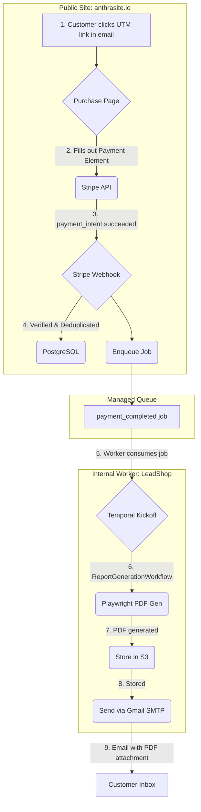

# SYSTEM.md (v1.3)

**Project**: Anthrasite.io
**Last Updated**: 2025-10-10
**Change Summary**: Consolidated SYSTEM.md and SYSTEM 2.md; unified topology and ADR index.
**Owner**: Anthrasite Platform Team
**Status**: Canonical Architecture Document (Ground Truth)

## 1. Purpose & Core Principles

This document defines the authoritative architecture of the **Anthrasite.io Payment Site**. It captures both design intent and operational invariants to ensure the system remains reliable, secure, and maintainable.

-   **Separation of Concerns**: The public-facing website (`anthrasite.io` on Vercel) is fully decoupled from the internal report generation engine (`LeadShop` on a local Mac mini). They communicate via a durable, managed queue.
-   **Idempotency**: All critical operations, especially payment processing and workflow kickoff, are designed to be idempotent to prevent duplicate processing from events like webhook retries.
-   **Progressive Enhancement**: The system is built with MVP components (Playwright for PDFs, Gmail for email) that can be swapped for more robust, scalable solutions (DocRaptor, Postmark) as business needs evolve.
-   **Note on G1 Cleanup**: This system underwent a significant codebase cleanup (G1) in October 2025. Many legacy components were moved to a tracked `_archive` directory.

## 2. System Topology & Data Flow

The system is split into two primary operational environments, `anthrasite.io` (Vercel) and `LeadShop` (Mac Mini), bridged by a managed queue.

## 3. Core Technology Stack

| Layer | Technology | Notes |
| :--- | :--- | :--- |
| **Frontend** | Next.js (App Router) | React 18, streaming server components enabled |
| **Styling** | Tailwind CSS | Consistent with Anthrasite brand kit |
| **Database** | PostgreSQL (Vercel-hosted) | Supabase-compatible schema |
| **ORM** | Prisma | Enforces type safety and schema consistency |
| **Payments** | Stripe Payment Element | Embedded flow using `PaymentIntent` API |
| **Queue / Job Dispatch** | Vercel KV or Upstash Queue | Provides lightweight asynchronous job delivery |
| **Worker Runtime** | Node.js Worker or Supabase Edge Function | Consumes queued jobs and generates reports |
| **PDF Generation** | Playwright (print-to-PDF) | Deterministic, headless Chromium rendering |
| **Email Delivery** | Google Workspace (Gmail SMTP) | Provider-abstracted; swappable later for Postmark/SendGrid |
| **Testing** | Vitest (unit) / Playwright (E2E) | Modal pattern hardened for CI |
| **Deployment** | Vercel | Continuous deployment from main branch |

## 4. Key Architectural Decisions & Patterns

-   **ADR-P01 (Payment UX)**: Use Stripe's embedded **Payment Element**.
-   **ADR-P02 (Receipts)**: Enable Stripe's automated receipts with a **custom sending domain**.
-   **ADR-P03 (Website ↔ LeadShop Bridge)**: Implement a **managed queue** for durable communication.
-   **ADR-P04 (PDF Engine)**: Utilize **Playwright's print-to-PDF** as the MVP.
-   **ADR-P05 (Email Delivery)**: Send reports via **Gmail SMTP** using `nodemailer`.
-   **ADR-P06 (Pricing)**: Pricing is controlled by a **server-side allow-list** validated against a tier label in the UTM token.
-   **ADR-P07 (Deployment)**: `anthrasite.io` and `LeadShop` remain **separate projects and deployments**.
-   **ADR-P08 (Build-Time Rendering)**: Pages with runtime dependencies must be explicitly marked for dynamic rendering (`export const dynamic = 'force-dynamic'`)

**Operational Reliability Patterns:**
Anthrasite.io inherits the *Producer–Validator* and *Failure Contract* conventions defined in LeadShop’s SYSTEM.md §4.3 and §6, ensuring consistent idempotency and explicit validation across environments.

## 5. Post-G1 File Structure

-   `/app`: Core Next.js routing, including API routes and pages.
-   `/components`: Reusable React components.
-   `./docs`: Project documentation, including ADRs.
-   `./e2e`: Playwright end-to-end tests.
-   `/lib`: Shared libraries for services like database access and Stripe.
-   `/prisma`: Database schema and migration files.
-   `/_archive`: A tracked directory containing all non-essential files from before the G1 cleanup.

---
**Maintainer:** Anthrasite Platform Team
**Review Cadence:** Quarterly or on major ADR merge

---